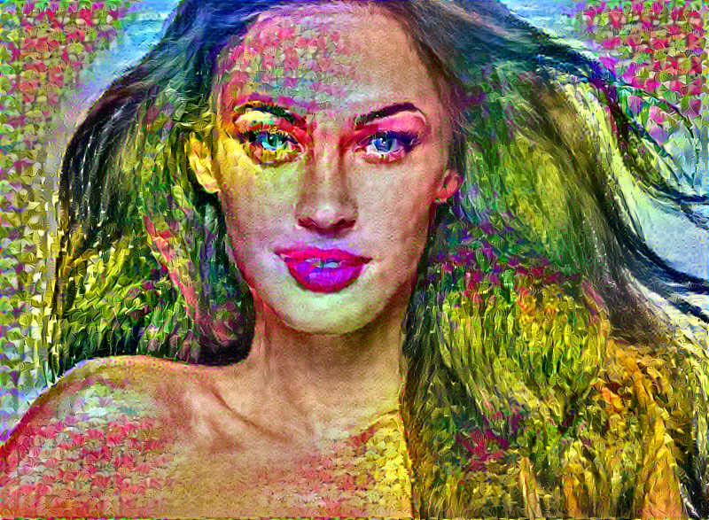
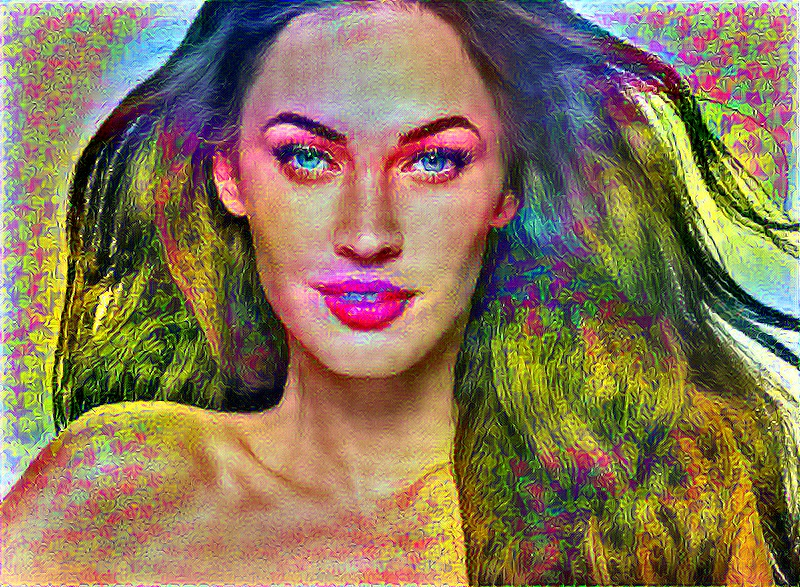
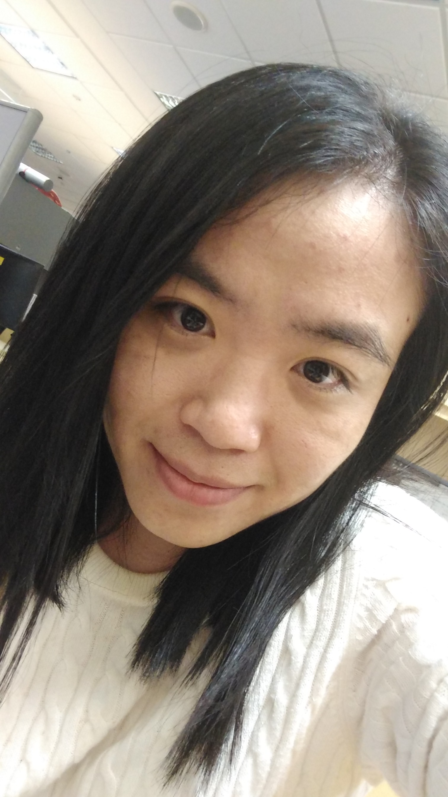
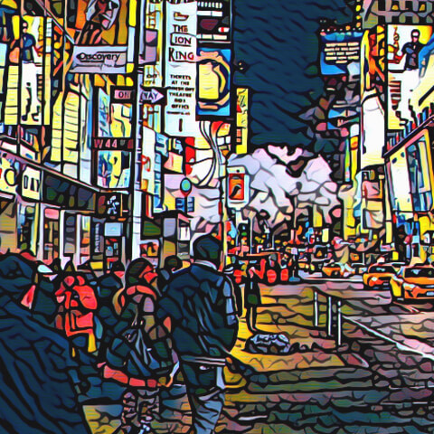
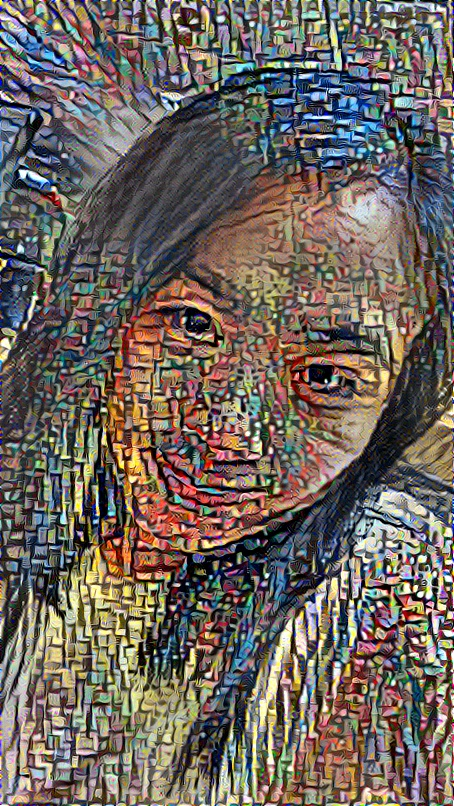
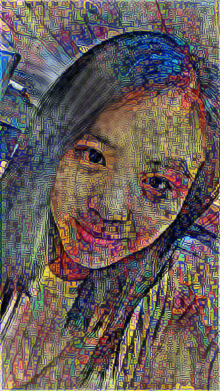

# Laplacian-preserving Neural Style Transfer

An image Laplacian loss is imposed to the original neural style transfer method, so that the produced image better preserves fine details of the original content image.

Check [https://github.com/anishathalye/neural-style] for original documentation.

The only extra command line argument:

`--content-lapweight` (default: 100)

An example command line:

`python neural_style.py --content megan.jpg --styles spring.jpg --output megan_spring.jpg --content-weight 50`

## Comparison with original method

Example 1:

The original method produces such an image:

A lot of unpleasing artifacts are visible, e.g. there is a big blob on Megan's face.

With the Laplacian loss constraint, the produced image becomes:

Example 2:

The style image is from Prisma.

The original method produces:

Again, the image, especially the face, is fragmented.

With the Laplacian loss constraint, the produced image becomes much more smooth, although less "stylish":

